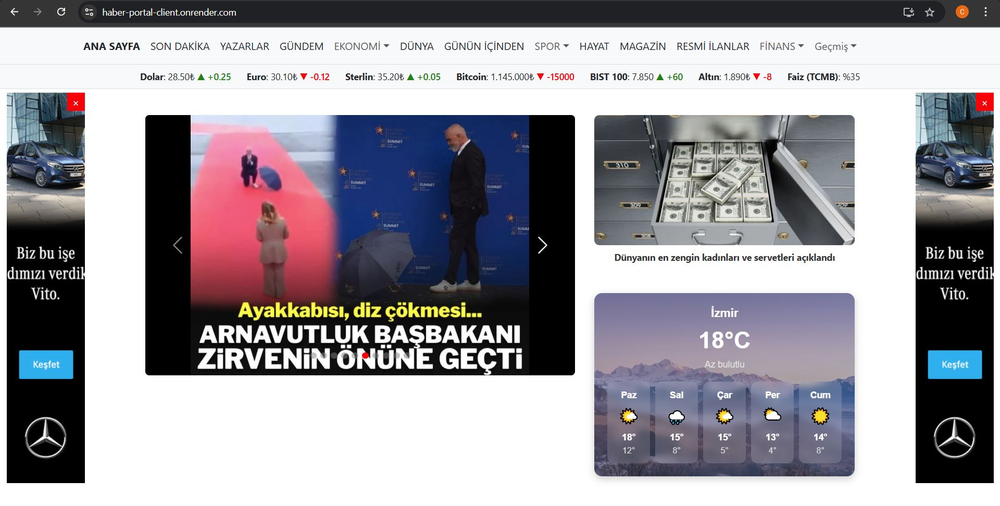
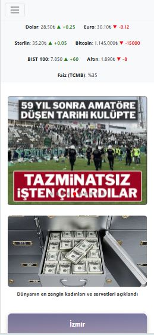

# 📰 News Portal (React + Express + SQLite)

This is a news portal web project built using React for the frontend and Express.js for the backend. It fetches news headlines, financial market data, and weather forecasts from a local SQLite database and renders them in a responsive, feature-rich interface.

---

## 🖼️ Screenshots

### 💻 Web View

### 📱 Mobile View

---

## 🧠 Stack

- React (frontend)  
- Redux (for tracking viewed news history)  
- Bootstrap 5 (styling and responsive layout)  
- Express.js (Node.js backend)  
- SQLite (local database)  

---

## 🚀 Features

- Sticky responsive Navbar with dropdown submenus (e.g. EKONOMİ, SPOR)  
- Two sticky ads on left and right that are closable and link to external pages  
- Slider on homepage shows 10 latest news headlines retrieved from the backend API  
- Each news item in the slider navigates to a separate detail page  
- Dynamic FinanceBar that fetches real-time mock financial data from backend API, including icons showing increase/decrease  
- WeatherBox showing 5-day weather forecast with icons and daily high/low temperatures  
- Background images and responsive grid layout  
- Redux integration to track last 10 visited news headlines and show them in "Geçmiş" (History) dropdown  
- Fully responsive layout (mobile/tablet/desktop)  

---

## 📂 Project Structure
/client → React frontend
/server → Express backend and SQLite database

---

---

## 📊 Backend API Endpoints

- `GET /api/news` – fetch all news for slider  
- `GET /api/finance` – fetch finance summary data  
- `GET /api/weather` – fetch weather forecast data (5-day)  

---

## 💾 Database

- SQLite is used for local persistent data  
- `news` table is initialized with 10 sample news items  
- News headlines, slugs, and images are stored and read from the DB  

---

## 🧪 Responsiveness

- Layout adapts to all screen sizes  
- Ads are visible only on desktop viewports  
- Slider, weather, and finance content stack neatly on smaller screens  

---

## 🧾 Deployment

This application has been **deployed** on [Render.com](https://render.com):

- 🔗 **Frontend (React):** https://haber-portal-client.onrender.com  
- 🔗 **Backend (Express API):** https://haber-portal.onrender.com  

> ⚠️ **Important Note:**  
> The frontend relies on the backend API.  
> Render.com's free tier puts backend services to sleep when idle.  
> Therefore, **before visiting the frontend**, first wake up the backend by visiting:  
> 👉 https://haber-portal.onrender.com  
> Wait a few seconds until the backend is fully active, then open the frontend link.

